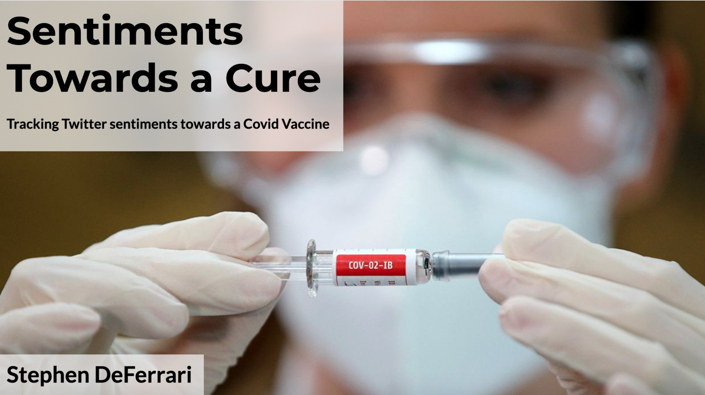
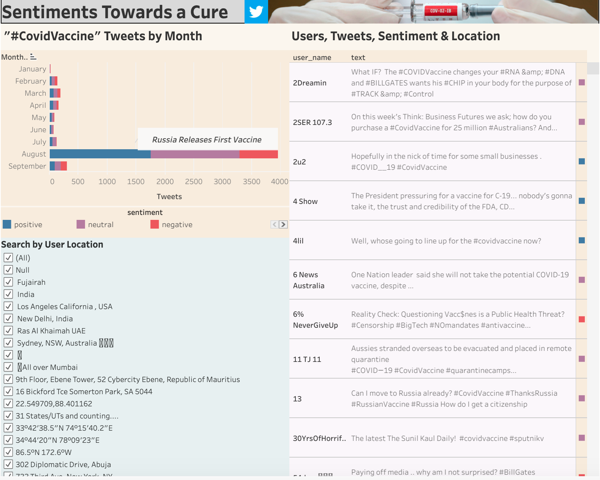

# Vaccine-Tweets-NLP

**Natural Language Processing(NLP) project performing sentiment analysis on tweets related to vaccines for Covid-19 over time.**

In this repo you will find the following files:
* My [powerpoint presentation](https://github.com/S-DeFerrari/Vaccine-Tweets-NLP/blob/main/Vaccine-Tweets-NLP.pdf) on this project going over each step of the process as well as my results. This is the best place to start.
* The [jupyter notebook](https://github.com/S-DeFerrari/Vaccine-Tweets-NLP/blob/main/Vaccine%20NLP.ipynb) I used for this project.

The [data](https://www.kaggle.com/kaushiksuresh147/covidvaccine-tweets) for this project comes from Kaggle.com.

## Tableau Dashboard

Please take a look at the [dashboard](https://public.tableau.com/profile/stephen.deferrari#!/vizhome/CovidVaccineDashboard/Dashboard1) I made for this project. It lets you filter by locations, dates, and sentiment and see all of the tweets that meet your criteria. I spent a lot of time making it look nice.

Thank you for looking through my work, let me know if you have any comments or questions.
